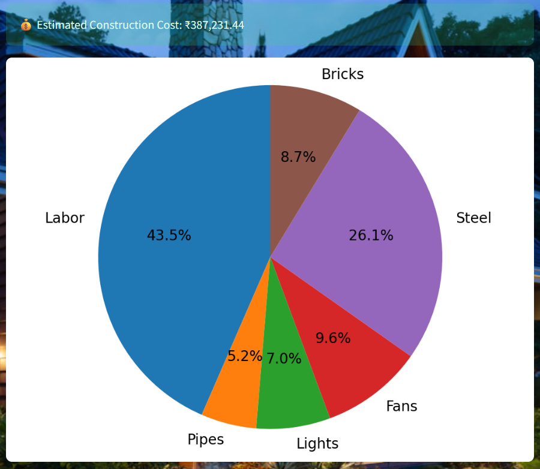

# House-Construction-Cost-Predictions-
Data Analytics project to  predict house construction cost.

This project predicts the construction cost of a house based on different inputs like area, labor cost, materials, and utilities. It uses Machine Learning (Linear Regression) to give an estimated cost.

Features
* User login with username & password
* Predicts house construction cost based on given inputs
* Interactive charts (Bar Graph + Pie Chart)
* Clean UI built with Streamlit

  Installation

Clone or download this repository.

Install the required libraries:
pip install -r requirements.txt

Run the app:
app.py ,
streamlit run app_streamlit.py

Login Credentials
Username: admin
Password: house1234

Example Outputs :
Predicted cost of construction
Bar chart showing cost contribution of materials
Pie chart for cost distribution

,(Screenshot3.png)
